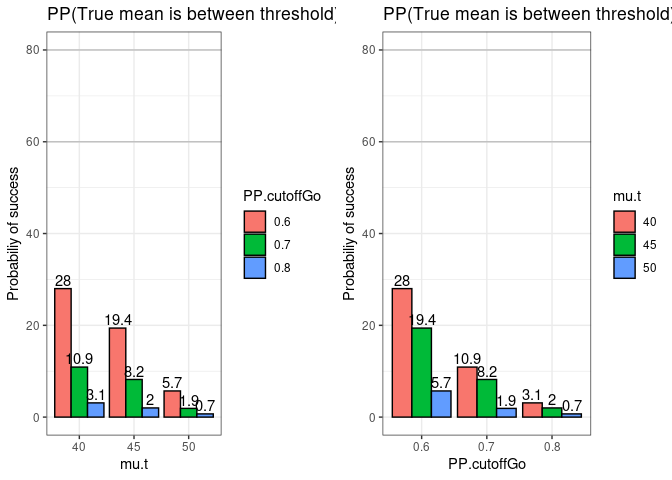

<!-- README.md is generated from README.Rmd. Please edit that file -->

# GoNoGo

<!-- badges: start -->
<!-- badges: end -->

The goal of `GoNoGo` is to provide the posterior probability and
operating characteristics of Bayesian Go/No-Go decision-making based on
specific model assumptions. Currently, it specifically covers scenarios
involving single normal mean, two independent normal mean differences,
and two independent normal mean ratio analysis, considering both
informative and non-informative priors. For a more in-depth
understanding of the technical aspects, please refer to the `Vignette`.

## Dependencies

`GoNoGo` requires the following `R` package: `devtools` (for
installation only). Please install it before installing `GoNoGo`, which
can be done as follows (execute from within a fresh `R` session):

``` r
install.packages("devtools")
library(devtools)
```

## Installation

Once the dependencies are installed, `GonoGo` can be loaded using the
following command:

``` r
devtools::install_github("Merck/GoNoGo")
library(GoNoGo)
```

## Scenarios (In current version)

- Operating characteristics
  - Normal 1 sample - Prior: non-informative - Hypothesis: greater than,
    less than, between
  - Normal 1 sample - Prior: informative - Hypothesis: greater than,
    less than, between
  - Normal 2 sample - Difference/ratio - Prior: non-informative -
    Hypothesis: greater than, less than, between
  - Normal 2 sample - Difference/ratio - Prior: informative -
    Hypothesis: greater than, less than, between
- Posterior probability
  - Normal 1 sample - Prior: non-informative - Hypothesis: greater than,
    less than, between
  - Normal 1 sample - Prior: informative - Hypothesis: greater than,
    less than, between
  - Normal 2 sample - Difference/ratio - Prior: non-informative -
    Hypothesis: greater than, less than, between
  - Normal 2 sample - Difference/ratio - Prior: informative -
    Hypothesis: greater than, less than, between
- Plot

## Example 1 (Operating characterstics)

This is a basic example which shows you how to generate operating
characteristics for a normal one sample non-informative prior with
hypothesis = “greater than”:

``` r
##################
# Load libraries #
##################

library(GoNoGo)
library(ggplot2)
library(grid)
library(gridExtra)

n.t = rep(8, 9) # Sample size in treatment arm
mu.t = rep(c(40, 45, 50), each = 3) # True mean of the treatment arm
sd.t = rep(15, 9) # True sd of the treatment arm
hypothesis = "between" # "greater than", "less than", "between"
threshold =  matrix(rep(c(35, 45), each = 9), ncol = 2) # k: Target region cut-off 
PP.cutoffGo = rep(c(0.6, 0.7, 0.8), 3) # c1: Cut-off for probability of Go
PP.cutoffNoGo = rep(c(0.6, 0.7, 0.8), 3) # c2: Cut-off for probability of No-Go
prior = "non-informative" # Prior choice
reps = 1000 # Number of repetitions for samples from the posterior using simulation
nsim = 1000 # Number of simulations

set.seed(1234)
pos.val = vector("list", length(n.t))
for(i in 1:length(n.t)){
  pos.val[[i]] = Normal1SampleGNG(n.t = n.t[i], mu.t = mu.t[i], sd.t = sd.t[i], 
                                  hypothesis = hypothesis, threshold = threshold[i,],
                                  PP.cutoffGo = PP.cutoffGo[i], 
                                  PP.cutoffNoGo = PP.cutoffNoGo[i],
                                  nsim = nsim, reps = reps)$pos
}
data = dataoutput(prob.val = pos.val)
data$mu.t = unlist(data$mu.t)
data$PP.cutoffGo = unlist(data$ PP.cutoffGo)

data$mu.t = as.factor(data$mu.t)
data$PP.cutoffGo = as.factor(data$ PP.cutoffGo)

data
#>   n.t mu.t sd.t   threshold PP.cutoffGo PP.cutoffNoGo hypothesis
#> 1   8   40   15 ( 35 , 45 )         0.6           0.6    between
#> 2   8   40   15 ( 35 , 45 )         0.7           0.7    between
#> 3   8   40   15 ( 35 , 45 )         0.8           0.8    between
#> 4   8   45   15 ( 35 , 45 )         0.6           0.6    between
#> 5   8   45   15 ( 35 , 45 )         0.7           0.7    between
#> 6   8   45   15 ( 35 , 45 )         0.8           0.8    between
#> 7   8   50   15 ( 35 , 45 )         0.6           0.6    between
#> 8   8   50   15 ( 35 , 45 )         0.7           0.7    between
#> 9   8   50   15 ( 35 , 45 )         0.8           0.8    between
#>             prior nsim reps      time probGo probNoGo
#> 1 non-informative 1000 1000 0.7117572   28.0     72.0
#> 2 non-informative 1000 1000 0.6791127   10.9     89.1
#> 3 non-informative 1000 1000 0.6783869    3.1     96.9
#> 4 non-informative 1000 1000 0.6788502   19.4     80.6
#> 5 non-informative 1000 1000 0.7581697    8.2     91.8
#> 6 non-informative 1000 1000 0.6835802    2.0     98.0
#> 7 non-informative 1000 1000 0.6700401    5.7     94.3
#> 8 non-informative 1000 1000 0.6826077    1.9     98.1
#> 9 non-informative 1000 1000 0.7465584    0.7     99.3
```

``` r
p1 = GNGplot(data = data, x.var = data$mu.t,
                     fill.var = data$PP.cutoffGo,
                     hypothesis = data$hypothesis,
                     x.lab = "mu.t",
                     title.text =  paste("PP(True mean is", hypothesis, 
                                         "threshold) >= PP cutoff"),
                     legend.title.text = "PP.cutoffGo")

p2 = GNGplot(data = data, x.var = data$PP.cutoffGo,
                     fill.var = data$mu.t,
                     hypothesis = data$hypothesis,
                     x.lab = "PP.cutoffGo",
                     title.text =  paste("PP(True mean is", hypothesis, 
                                         "threshold) >= PP cutoff"),
                     legend.title.text = "mu.t" )

grid.arrange(p1, p2, nrow = 1)
```



## Example 2 (Posterior probability)

This is a basic example which shows you how to generate posterior
probability based on the previous parameters.

``` r
set.seed(1234)
pp.val = vector("list", length(n.t))
for(i in 1:length(n.t)){
  pp.val[[i]] = Normal1SamplePP(n.t = n.t[i], mu.t = mu.t[i], sd.t = sd.t[i],
                                hypothesis = hypothesis, 
                                threshold = threshold[i,], prior = prior, 
                                PP.cutoffGo = PP.cutoffGo[i], 
                                PP.cutoffNoGo = PP.cutoffNoGo[i], reps = reps)
}
posterior.prob = dataoutput(prob.val = pp.val, output.format = "PP")
posterior.prob
#>   n.t mu.t sd.t   threshold PP.cutoffGo PP.cutoffNoGo hypothesis
#> 1   8   40   15 ( 35 , 45 )         0.6           0.6    between
#> 2   8   40   15 ( 35 , 45 )         0.7           0.7    between
#> 3   8   40   15 ( 35 , 45 )         0.8           0.8    between
#> 4   8   45   15 ( 35 , 45 )         0.6           0.6    between
#> 5   8   45   15 ( 35 , 45 )         0.7           0.7    between
#> 6   8   45   15 ( 35 , 45 )         0.8           0.8    between
#> 7   8   50   15 ( 35 , 45 )         0.6           0.6    between
#> 8   8   50   15 ( 35 , 45 )         0.7           0.7    between
#> 9   8   50   15 ( 35 , 45 )         0.8           0.8    between
#>             prior reps         time    pp
#> 1 non-informative 1000 0.0006725788 0.622
#> 2 non-informative 1000  0.000648737 0.621
#> 3 non-informative 1000 0.0006375313 0.641
#> 4 non-informative 1000 0.0006489754 0.424
#> 5 non-informative 1000 0.0006213188 0.453
#> 6 non-informative 1000 0.0006527901 0.466
#> 7 non-informative 1000 0.0006437302 0.205
#> 8 non-informative 1000 0.0006444454 0.180
#> 9 non-informative 1000 0.0006220341 0.164
```

# Work in progress

Currently, the followings are in progress

- R-shiny app corresponding to Normal
- Binary Go/No-Go.
